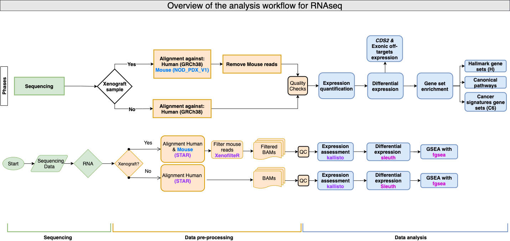

# Analysis of the transcriptional effects of _CDS2_ targeting - RNAseq

## Overview 
This repository contains the code used in the identification differentially expressed genes in comparisons made using the RNAseq data obtained from SW837 and xenografted OMM2.5 cell-lines targeted with CRISPR-Cas9 safe (_STG1_) and _CDS2_ single guide RNAs. These analyses were used to assess _CDS2_ expression in the transcriptome of the samples of both experiments for _Targeting the CDS1/2 axis as a therapeutic strategy in uveal melanoma and pan-cancer_ paper.

## Experimental design

The data analysed with the code in the present repository originates from two different targeting experiments. Two different cancer cell-lines constitutively expressing CRISPR-Cas9 were transduced, with a safe targeting gRNA (_STG1_) or a single gRNA targeting _CDS2_. A short description of the experiments is provided below: 

1. **SW837 _CDS2_ targeting**: This experiment was performed _in vitro_ on the Colorectal adenocarcinoma cancer cell-line SW837. The Cas9 expressing cell-line was infected with either a single gRNA targeting _CDS2_ or a safe targeting gRNA _STG1_. After being selected in puromycin, cells were then harvested and RNA extracted for RNA sequencing. Data was generated for **three biological replicates** of uninfected, _STG1_ and _CDS2_ targeted SW837 cells.

2. **OMM2.5 xenografts**: For this experiment, Uveal Melanoma OMM2.5 - Cas9 cells were transduced with a tet-inducible gRNA construct containing either a _CDS2_ or safe targeting gRNA (_STG1_). Subsequently, cells were grafted for an _in vivo_ growth assessment under different chow regimes; with and without doxycyline. The tumours were then harvested and RNA extracted for RNA sequencing. Data was generated for **four biological replicates** for each of the **three** groups of interest. 

The table containing the metadata of all the samples and the experimental group and conditions that each sample belongs to can be found in the (`Group` column) on the [metadata table here](./metadata/7687_3364_sample_metadata.tsv) inside the `metadata` directory. 

## Analysis workflow overview

The analyses were performed using a combination of R, shell and Perl scripts. The workflow depicted below shows the steps followed in the analysis of the sequencing data and the differences required due to the experimental designs.

The overall analysis workflow after the sequencing data was generated was divided into three stages:

2. **Data Pre-processing**: This section includes the alignment to the required reference genomes, GRCh38 for Human alongside ENSEMBLv103 annotation and custom [NOD_ShiLtJ_V1_PDX](./reference/NOD_ShiLtJ_V1_PDX_ref/README.md) mouse reference with annotations from ENSEMBL v107 to filter mouse reads from the Human mapped BAM files using **XenofilteR**. Alignment against the Human reference genome was performed in the same way for both datasets. Instructions on how the custom mouse reference and analyses at these stage were performed can be found in the [README here](./documentation/Alignment_and_Filtering_of_mouse_reads_wXenofilteR.md). 
  
3. **Data analysis - Expression quantification**: This section delineates the parameters used for the transcript quantification analysis.  Instructions on how the quantification was performed can be found in the [README here](./documentation/Transcript_quantification_analysis.md).

4. **Data analysis - Differential gene expression**: This section describes the different comparisons made to identify differentially expressed genes  and gene set enrichment analysis.  Instructions on how the analyses at these stage were performed can be found in the [README here](./documentation/Expression_analysis.md).

## Results 
 
The folders with the results and plots used in the paper for the differential expression analyses with the multiple paired comparisons are generated by the code within the `analysis/expression_analysis` directory. However, given the number of files and file sizes, the results were uploaded to **figshare** and can be downloaded from the **figshare** dataset [Expression data and differential expression analysis of CDS2 targeted SW837 and OMM2.5 xenografted cells](https://figshare.com/articles/dataset/Expression_data_and_differential_expression_analysis_of_i_CDS2_i_targeted_SW837_and_OMM2_5_xenografted_cells/28016804)
 
To reproduce the results, files and plots, please follow the instructions in the [README here](./documentation/Expression_quantification_DE_data_analysis.md).

## Software dependencies

Analyses were performed using a combination of R, and shell scripts.

- All R scripts were run using `R v4.4.1`for differential expression analysis and `R4.2.2` for mouse read filtering. All the packaged dependencies for each analysis are detailed within the `renv.lock` file of each analysis folder in the `scripts` directory.
- The following software was used:
  - `samtools` version`v1.14` [**here**](https://github.com/samtools/samtools)
  - `STAR` version `2.7.10a` [**here**](https://github.com/alexdobin/STAR/tree/2.7.10a)
  - `XenofilteR` version `1.6` [**here**](https://github.com/NKI-GCF/XenofilteR/releases/tag/v1.6)
  - `singularity` version `3.11.4` [**here**](https://sylabs.io/singularity/)
  - `kallisto` version `0.51.1` [**here**](https://github.com/pachterlab/kallisto/tree/v0.51.1)
  - `sleuth` version `0.30.1` [**here**](https://github.com/pachterlab/sleuth/tree/v0.30.1)
 
- External Datasets
  - ENSEMBL v`103`[**here**](http://feb2021.archive.ensembl.org/index.html)
  - ENSEMBL v`107`[**here**](http://jul2022.archive.ensembl.org/index.html)

